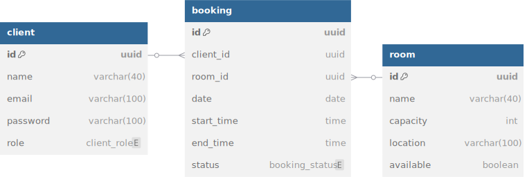

# WAD - Web Application Document - Reserva de Salas - Inteli

## Eduardo Alonso Casarini 

#### Sistema de Reserva de Salas

## Sumário

[1. Introdução](#c1)

[2. Diagrama do Banco de Dados](#c2)

[3. Diagrama de Arquitetura MVC](#c3)

[4. Configuração do BD, Migrações e Teste de APIs](#c4)

 

# 1. Introdução

Este documento WAD (Web Application Documentation) tem como objetivo registrar as decisões técnicas, estruturais e funcionais adotadas no desenvolvimento do projeto individual.

O projeto consiste na construção de um sistema web de reserva de salas, que permite que usuários visualizem salas disponíveis, façam reservas com data e horário definidos, e acompanhem o status de suas solicitações. A proposta simula um cenário real de gestão de espaços compartilhados, como salas de reunião, auditórios ou ambientes acadêmicos. 

A aplicação foi desenvolvida utilizando _Node.js_ com o framework _Express.js_, empregando o padrão de arquitetura MVC (Model-View-Controller) para garantir uma separação clara de responsabilidades entre dados, interface e lógica de controle. As views foram construídas com o motor de template _EJS_, possibilitando a geração dinâmica de páginas _HTML_ com base nas informações do banco de dados.

O sistema utiliza um banco de dados _PostgreSQL_ hospedado no _Supabase_, responsável por armazenar as informações de usuários (client), salas (room) e reservas (booking). A integração com o banco foi feita por meio da biblioteca pg, com as credenciais de acesso gerenciadas de forma segura via variáveis de ambiente definidas em um arquivo .env.

Este WAD foi estruturado para servir como guia técnico do projeto, facilitando a compreensão do sistema por avaliadores, colaboradores e qualquer pessoa que deseje manter ou evoluir a aplicação.

# 2. Diagrama do Banco de Dados

O diagrama do banco de dados é uma representação visual da estrutura lógica das informações que serão manipuladas pela aplicação. Ele é essencial para entender como os dados se organizam, se relacionam e sustentam as funcionalidades do sistema. Através da modelagem, é possível garantir a integridade, consistência e escalabilidade da base de dados desde as primeiras etapas do desenvolvimento.

No contexto deste projeto — um sistema web de reserva de salas — o diagrama foi planejado para representar de forma clara e eficiente os principais elementos da aplicação: usuários, salas e reservas. A proposta do sistema é permitir que usuários realizem reservas de salas com data e horário definidos, garantindo que os dados dessas interações fiquem devidamente registrados, rastreáveis e organizados.

A modelagem foi construída com base nas seguintes entidades:

- `client` : representa os usuários da aplicação. Cada cliente pode ser um usuário comum ou um administrador, com acesso diferenciado no sistema.

- `room` : representa as salas disponíveis para reserva, com informações como nome, capacidade, localização e disponibilidade.

- `booking` : representa as reservas realizadas, ligando um usuário a uma sala em um intervalo de tempo específico, com status definido.

Essas entidades se relacionam por meio de chaves estrangeiras, compondo dois relacionamentos do tipo 1:N (um para muitos):

Um cliente pode ter múltiplas reservas;

Uma sala pode estar associada a múltiplas reservas.

Abaixo está o diagrama entidade-relacionamento (ER) criado para representar essas estruturas e relações:

Figura 1: Diagrama-ER

Fonte: Autoria própria (2025)

# 3. Diagrama de Arquitetura Model-View-Controller

A arquitetura Model-View-Controller (MVC) é um padrão de design amplamente utilizado no desenvolvimento de sistemas web para promover a separação de responsabilidades. Essa abordagem organiza a aplicação em três componentes principais, garantindo maior modularidade, facilidade de manutenção e escalabilidade. No contexto deste projeto de Sistema de Reserva de Salas, a implementação do MVC é fundamental para gerenciar de forma eficiente as interações entre o usuário, a lógica de negócio e o banco de dados.

No nosso sistema, cada camada desempenha um papel distinto:

* **Model (Representado pela camada `services/`):** É a camada responsável pela manipulação dos dados e pela lógica de acesso ao banco de dados. Em nosso projeto, essa função é desempenhada pelos arquivos dentro da pasta `services/`, que interagem diretamente com o PostgreSQL através da configuração em `config/db.js`. Eles contêm as operações CRUD (Create, Read, Update, Delete) para as entidades `client`, `room` e `booking`, assegurando a integridade e consistência dos dados.
* **View (Representado pela pasta `views/`):** Consiste na interface que o usuário final interage. No nosso caso, as views são construídas com o motor de templates EJS (na pasta `views/`), responsável por renderizar dinamicamente as páginas HTML que o usuário visualiza no navegador, apresentando as informações de forma clara e intuitiva.
* **Controller (Representado pela pasta `controllers/`):** Atua como o intermediário entre o Model e a View, gerenciando o fluxo da aplicação. Os controladores em `controllers/` recebem as requisições HTTP das rotas, processam a lógica de negócio (delegando tarefas aos `services`), e preparam os dados para serem exibidos pela View, ou enviam respostas JSON para as requisições de API.
* **Rotas (Representado pela pasta `routes/` e `server.js`):** Definem os caminhos (URLs) e os métodos HTTP (GET, POST, PUT, DELETE) que acionam as funções específicas nos controladores, direcionando as requisições para a lógica correta.

O diagrama a seguir ilustra visualmente essa arquitetura, demonstrando o fluxo de dados e a comunicação entre cada componente, desde a requisição do usuário até a interação com o banco de dados e o retorno da resposta.

Figura X: Diagrama de Arquitetura MVC

 

Fonte: Autoria própria (2025)

